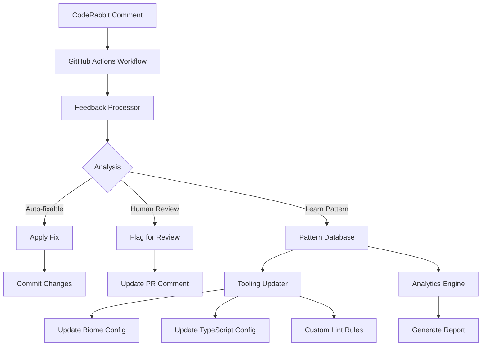

# CodeRabbit Feedback Loop System

A comprehensive automated feedback processing and learning system that transforms CodeRabbit suggestions into actionable improvements for development tooling.

## 🎯 Overview

The CodeRabbit Feedback Loop System automatically:

1. **Monitors** CodeRabbit comments on Pull Requests
2. **Extracts** actionable feedback and categorizes it
3. **Applies** automatic fixes where safe and possible
4. **Learns** patterns from feedback over time
5. **Updates** development tooling to prevent future issues
6. **Generates** analytics reports for continuous improvement

## 🏗️ Architecture



## 📂 System Components

### Core Scripts

| Script | Purpose | Usage |
| --- | --- | --- |
| `process-coderabbit-feedback.ts` | Main feedback processor | Triggered by GitHub Actions |
| `update-tooling-from-patterns.ts` | Updates dev tooling | Runs after pattern learning |
| `generate-feedback-report.ts` | Analytics and reporting | Manual or scheduled |
| `pattern-database.json` | Pattern storage | Automatically managed |

### GitHub Actions Workflows

- **`coderabbit-feedback-loop.yml`**: Main workflow triggered on CodeRabbit comments
- Processes feedback, applies fixes, and updates tooling configurations
- Posts results back to PR as comments

### Pattern Categories

1. **Auto-fixable**: Issues that can be safely fixed automatically
   - Unused imports
   - Missing `await` keywords
   - `let` vs `const` usage
   - Missing semicolons
   - Unnecessary `else` statements

2. **Needs Human Review**: Complex issues requiring developer judgment
   - Architecture concerns
   - Security issues
   - Performance problems
   - Breaking changes

3. **Pattern to Learn**: New patterns for future tooling improvements
   - Frequent suggestions not yet automated
   - Custom rule opportunities

## 🚀 Getting Started

### Prerequisites

- Bun 1.2.19+
- GitHub repository with CodeRabbit enabled
- Write access to repository for automated commits

### Installation

The system is automatically available in this monorepo. No additional installation required.

### Configuration

1. **GitHub Secrets**: Ensure `GITHUB_TOKEN` has appropriate permissions
2. **Pattern Database**: Will be created automatically on first run
3. **Tooling Configs**: Enhanced configs will be generated as needed

## 💻 Usage

### Manual Processing

Process a specific CodeRabbit comment:

```bash
bun run coderabbit:process \
  --pr-number 123 \
  --comment-id 456 \
  --comment-type review \
  --github-token $GITHUB_TOKEN
```

### Update Tooling

Apply learned patterns to development tooling:

```bash
bun run coderabbit:update-tooling
```

### Generate Reports

Create analytics reports:

```bash
# Markdown report
bun run coderabbit:report

# JSON report
bun run coderabbit:report:json

# Both formats
bun run coderabbit:report:both
```

### Run Tests

Test the feedback system:

```bash
bun run coderabbit:test
```

## 📊 Analytics & Reporting

The system generates comprehensive reports including:

### Metrics Tracked

- **Pattern Frequency**: How often specific issues occur
- **Category Distribution**: Auto-fixable vs human review vs learning
- **Prevention Rate**: How much current tooling prevents issues
- **Timeline Trends**: Pattern evolution over time
- **Tooling Effectiveness**: Rule impact analysis

### Report Formats

- **Markdown**: Human-readable reports in `docs/reports/`
- **JSON**: Machine-readable data for integration
- **Dashboard**: Visual analytics (future enhancement)

### Sample Report Structure

```markdown
# CodeRabbit Feedback Analysis Report

## 📊 Overview

- Total Patterns: 45
- Prevention Rate: 72.3%
- Configuration Health: Good

## 🏆 Top Patterns

1. Unused imports (15 occurrences)
2. Missing await (12 occurrences)
3. Type annotations (8 occurrences)

## 🎯 Recommendations

1. Enable noUnusedImports rule
2. Add floating promises detection
3. Enforce explicit return types
```

## 🔧 Configuration

### Pattern Recognition Thresholds

```json
{
  "autoFixThreshold": 0.7,
  "patternRecognitionMinOccurrences": 3,
  "maxExamplesPerPattern": 5,
  "dataRetentionDays": 365
}
```

### Auto-Fix Safety

The system only applies fixes when:

- Confidence level > 70%
- Pattern is recognized as safe
- File exists and is readable
- Changes can be validated

### Tooling Updates

Automatic updates are applied to:

- **Biome**: Linting rules and formatter config
- **TypeScript**: Compiler options for type safety
- **Custom Rules**: Project-specific validations
- **Pre-commit**: Validation enhancements

## 🔒 Security & Safety

### Safety Measures

1. **Dry Run Mode**: Test changes without applying them
2. **Confidence Thresholds**: Only high-confidence fixes are applied
3. **Pattern Validation**: All patterns are validated before storage
4. **Rollback Capability**: Git history preserves all changes
5. **Human Review**: Complex issues always flagged for review

### Security Considerations

- GitHub token permissions are scoped appropriately
- No sensitive data is stored in pattern database
- All file operations use absolute paths
- Input validation on all external data

## 📈 Performance

### Optimization Features

- **Incremental Processing**: Only process new comments
- **Efficient Pattern Matching**: Compiled regex patterns
- **Batched Updates**: Multiple fixes in single commit
- **Caching**: GitHub API responses cached when possible

### Performance Metrics

- Average processing time: < 30 seconds per comment
- Pattern database size: ~1MB for 1000 patterns
- Memory usage: < 100MB during processing

## 🧪 Testing

### Test Coverage

- **Unit Tests**: Individual component testing
- **Integration Tests**: End-to-end workflow testing
- **Performance Tests**: Large dataset processing
- **Safety Tests**: Edge cases and error handling

### Running Tests

```bash
# Full test suite
bun run coderabbit:test

# Specific test files
bun test scripts/__tests__/coderabbit-feedback-system.test.ts

# With coverage
bun test --coverage
```

## 🐛 Troubleshooting

### Common Issues

1. **Workflow Not Triggering**
   - Check CodeRabbit bot username in workflow
   - Verify GitHub token permissions
   - Ensure comment contains CodeRabbit markers

2. **Fixes Not Applied**
   - Check confidence threshold settings
   - Verify file permissions and paths
   - Review error logs in Actions

3. **Pattern Database Corruption**
   - Delete and recreate `pattern-database.json`
   - Check JSON syntax validity
   - Restore from backup if available

### Debug Mode

Enable debug logging:

```bash
DEBUG=true bun run coderabbit:process [options]
```

### Log Analysis

Check GitHub Actions logs for:

- Pattern recognition results
- Fix application attempts
- Database update status
- Tooling configuration changes

## 📚 Examples

### Example CodeRabbit Comment Processing

**Input Comment:**

```text
Remove unused import `lodash` as it is not being used in this file.

Consider using `formatDate` from `date-fns` instead for better tree-shaking.
```

**System Processing:**

1. **Analysis**: Categorized as "auto-fixable" with 90% confidence
2. **Fix Applied**: Removes unused lodash import
3. **Pattern Learned**: Updates unused import frequency counter
4. **Tooling Update**: Suggests enabling `noUnusedImports` rule

**Output:**

- Fixed code committed to PR
- Pattern database updated
- PR comment with processing results
- Enhanced Biome config generated

### Example Pattern Learning

After processing 5+ similar comments about missing `await`:

```json
{
  "pattern": "Add missing await keyword",
  "category": "auto-fixable",
  "frequency": 8,
  "suggestedToolingUpdate": {
    "tool": "biome",
    "rule": "suspicious/noFloatingPromises",
    "action": "enable"
  }
}
```

## 🛣️ Roadmap

### Planned Enhancements

1. **Advanced AST Processing**: More sophisticated code transformations
2. **AI-Powered Pattern Recognition**: Machine learning for better categorization
3. **Visual Dashboard**: Web interface for analytics
4. **Team Notifications**: Slack/Discord integration for high-impact patterns
5. **Cross-Repository Learning**: Share patterns across projects
6. **Custom Rule Generator**: Automatic custom lint rule creation

### Future Integrations

- **ESLint**: Support for ESLint rule updates
- **Prettier**: Formatter configuration updates
- **Husky**: Git hook enhancements
- **CI/CD**: Integration with other quality gates

## 🤝 Contributing

### Development Setup

1. Clone the repository
2. Install dependencies: `bun install`
3. Run tests: `bun run coderabbit:test`
4. Make changes and test locally

### Adding New Fix Types

1. Add pattern recognition to `FeedbackAnalyzer`
2. Implement fix logic in `AutoFixEngine`
3. Add tests for the new fix type
4. Update documentation

### Pattern Database Schema

```typescript
interface PatternLearned {
  pattern: string;
  category: 'auto-fixable' | 'needs-human-review' | 'pattern-to-learn';
  description: string;
  frequency: number;
  firstSeen: string;
  lastSeen: string;
  examples: Array<{
    file: string;
    line: number;
    context: string;
  }>;
}
```

## 📄 License

This system is part of the Outfitter monorepo and follows the same MIT license.

---

**Need Help?**

- 📖 Check this documentation first
- 🐛 Create an issue for bugs
- 💡 Open a discussion for feature requests
- 📧 Contact the maintainers for urgent issues

_Last updated: January 19, 2025_
